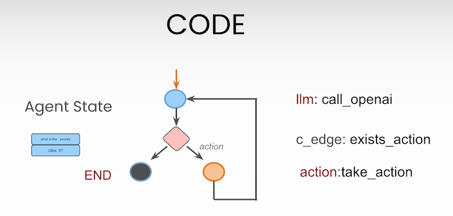
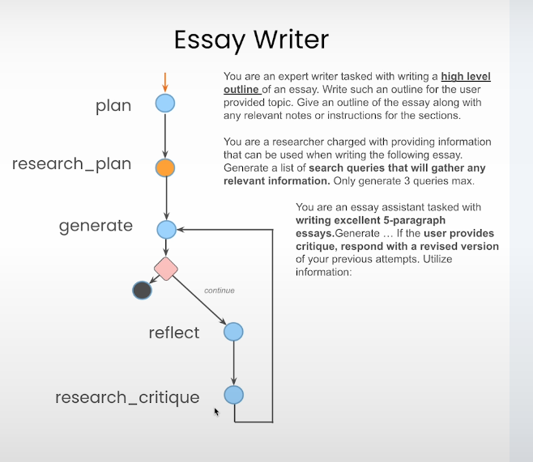

# AI Agents with Langgraph

## Introduction

AI Agents allows LLMs to perform tasks by giving them access to state and tools.
The state refers to the context LLM is working on, LLM us previous and current
context to guide its decision making for subsequent actions. To complete the
action the LLM has planned, a tool is used. This might be an database, api,
external application etc.

Langraph is an orchestration framework for complex agentic systems. It supports
various agentic designs such as ReAct(Reason + Act), SELF-REFINE (Iterative
refinment with self-feedback) etc. To support such complex agentic frameworks
Langchain offers Langgraph.

## Ai Agents From Scratch

Lets develop an simple AI Agent from scratch, refer to this notebook, where we
implement an react(reasoning and action) agent model.

[react-implementation-from-scratch](1-react-implementation.ipynb)

## Implementing Ai Agent with Langgraph

In the previous exercise, we have implemented an ai agent which takes the user
query and hits the llm with the given prompt, which forces the agent to think
and respond to the query using the given tools (average_dog_weight and
calculate) and ouput the action and observation. Based on the output and
observation, we either run the loop back to the prompt appending the new message
or exit from the loop.

### LangChain Components

1. **Prompts**: Langchain provides a large catalog of promptTemplates which can
   be imported directly, we will be using the 'hwchase17/react' prompt. All the
   available prompts can be found in the langchain hub. The prompt template is
   as follows:

   ```
   Answer the following questions as best you can. You have access to the following tools:

   {tools}

   Use the following format:

   Question: the input question you must answer
   Thought: you should always think about what to do
   Action: the action to take, should be one of [{tool_names}]
   Action Input: the input to the action
   Observation: the result of the action
   ... (this Thought/Action/Action Input/Observation can repeat N times)
   Thought: I now know the final answer
   Final Answer: the final answer to the original input question

   Begin!

   Question: {input}
   Thought:{agent_scratchpad}
   ```

2. **Tools**: Tools help the agent to retrieve information from, we will be
   using the tool from tavily, which basically is the search engine that
   generates output in the agent friendly manner.

3. **Graphs (LangGraph)**: The major component of our code is the looping
   function and arraging all the components based on the actions and
   observations. LangGraph provides the orchestration required to do all the
   mentioned things. Langgraph is aimed for agents and multiagents which helps
   controlling the flow of the model.

   Different components in the Graph:

   - **Node**: Represents the agents or functions.
   - **Edge**: Represents the flow of information between the nodes.
   - **Connecting edges**: Represents the decisions.

4. **State**: Agent state (Data) is accessible to all the parts of the grpah, it
   is the local memeory to a graph and can be stored in a persistence layer
   (which can be stored and resumed from the same state later on).

   Ex:

   - **Simple State**:

     class AgentState(TypedDict) { messages: Annotated[Sequence[BaseMessage],
     operator.add] }

   - **Complex State**:

     class AgentState(TypedDict) { input: str chat_history: list[BaseMessage]
     agent_outcome: Union[AgentAction, AgentFinish, None] intermediate_steps:
     Annotated[list[tuple[AgentAction, str]], operator.add] }

     Annotated states mean if the new variable is pushed, the value is not
     overrided, instead appended (this behavior can be controlled using the
     operator variable)

## Implementation of the agent with Langchain components



Implemention of ai agent graph using langchain components and langgraph
framework, tavily search integration is in the following notebook:

[react-implementation-using-langchain.ipynb](2-react-implementation-using-langchain.ipynb)

### Persistence and Streaming

Persistence refers to go back to the state at any time. Stremming refers to
logging all the infomration to know what agent is exactly doing.

Refer to the follwoing notebook:
[persistence-and-streaming-examples.ipynb](3-persistence-and-streaming-examples.ipynb)

where we have added an SqliteSaver to save the checkpoints of the agents.

### Human in the loop interaction

Human in the loop interactions are used for approving the action of llm before
execution.

[human-in-loop](4-human-in-loop.ipynb)

ex This notebook also contains how we can go back in time and modify the states
of the agent

## Final Project

Let should the Essay writer, the architecture is shown in the figure.


